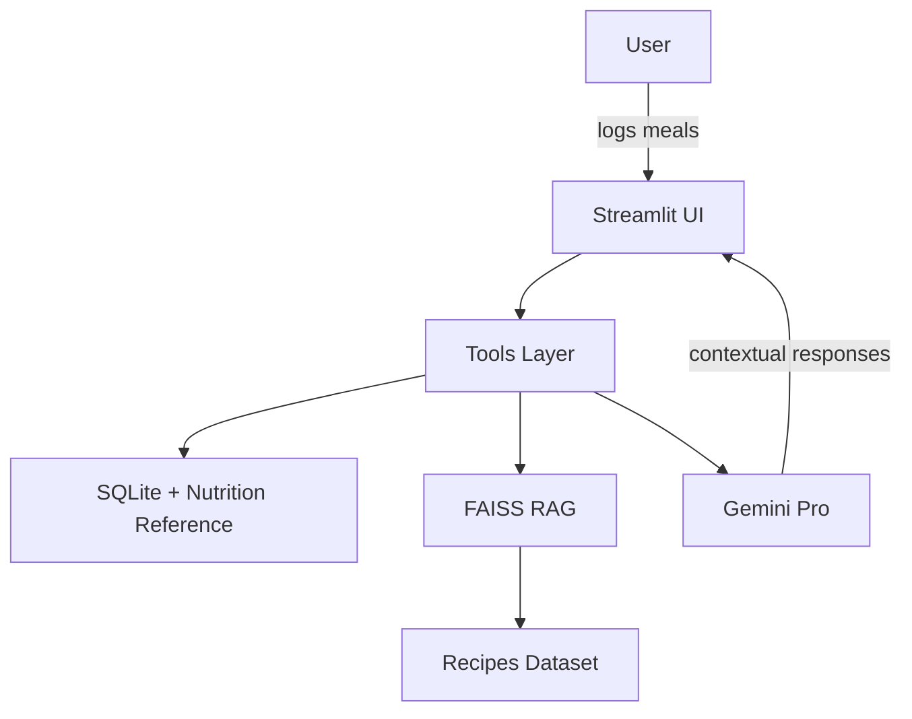

# NutriTrackAI

NutriTrackAI is a Streamlit-based nutrition assistant that combines Gemini Pro, LangChain, and FAISS-backed retrieval to help users log meals, build meal plans, generate grocery lists, and cook confidently.

## Quickstart

```bash
python3 -m venv .venv
source .venv/bin/activate
pip install -r requirements.txt
cp example.env .env  # add your GOOGLE_API_KEY
streamlit run src/app.py
```

On first launch the app will build a FAISS index from the bundled recipe dataset automatically. Use the sidebar button to rebuild the index if you add new data.

### Rebuilding the FAISS index manually

```bash
python -c "from src.core.rag import build_index; build_index(force=True)"
```

### Example workflows

1. **Daily logging** – Type `1 cup greek yogurt with blueberries and honey` on the Daily Log page and confirm the parsed macros.
2. **Weekly planning** – Set calorie and macro goals in the sidebar, click *Generate Plan*, and review the 7-day menu.
3. **Grocery prep** – Switch to the Grocery List page and export the categorized CSV list for shopping.
4. **Cooking mode** – Search for a recipe like “Teriyaki Tofu” in Cooking Assistant to receive step-by-step instructions with tips and substitutions.

## Architecture

```
NutriTrackAI
├── src/
│   ├── app.py               # Streamlit entry & navigation
│   ├── core/                # config, schemas, db, utils, prompts, embeddings
│   ├── tools/               # calorie tracker, planner, grocery, cooking helpers
│   ├── agent/               # LangChain wiring & middleware
│   └── ui/                  # Streamlit pages and reusable widgets
├── data/raw/                # recipe CSV + nutrition reference
└── data/processed/          # generated FAISS index and SQLite db
```



## Privacy & API Keys

- Store your `GOOGLE_API_KEY` in a local `.env` file that is never committed.
- Personal data such as meal logs remain on your machine in `data/processed/nutritrackai.db`.
- The bundled datasets are illustrative and should be replaced with organization-approved sources for production deployments.

## Testing

Run the automated test suite with:

```bash
pytest -q
```

